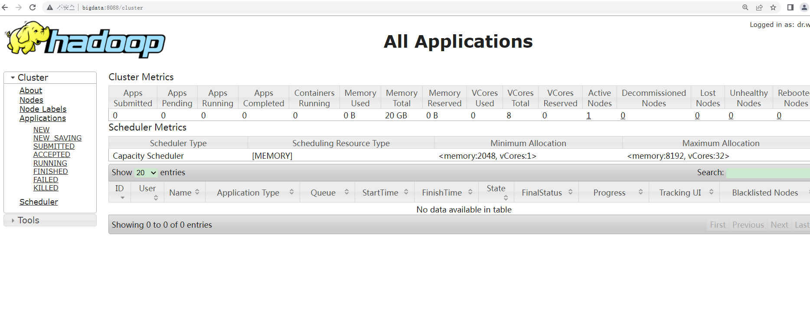

## 计算机毕业设计Hadoop+Spatk+Hive网约车供需平衡优化系统 出租车分析 网约车分析 滴滴出行分析(源码+LW+PPT+讲解)

## 要求
### 源码有偿！一套(论文 PPT 源码+sql脚本+教程)

### 
### 加好友前帮忙start一下，并备注github有偿26滴滴分析
### 我的QQ号是1957722142 或者 2827724252或者798059319或者 1679232425
### 或者微信:biyesheji1698 或者 bysj2023nb


### 加qq好友说明（被部分 网友整得心力交瘁）：
    1.加好友务必按照格式备注
    2.避免浪费各自的时间！
    3.当“客服”不容易，repo 主是体面人，不爆粗，性格好，文明人。
## 介绍

```
1. 系统背景与目标
网约车平台（如滴滴出行）的核心挑战在于动态供需匹配：在高峰时段（如早晚高峰、雨雪天气）或热点区域（如商圈、交通枢纽），乘客需求激增而司机供给不足，导致订单流失和用户体验下降。本系统基于Hadoop（HDFS+YARN）、Spark（实时计算）和Hive（数据仓库）构建，旨在通过大数据分析实现以下目标：

供需预测：预测未来15分钟至1小时的热点区域订单需求；
运力调度：优化司机分布，减少空驶率；
定价策略：动态调整价格（如滴滴的“高峰加价”）以平衡供需；
出租车与网约车协同：融合传统出租车数据，提升整体运力利用率。
数据规模：

日均处理订单数据：约5000万条（滴滴公开数据）；
存储容量：HDFS集群存储3年历史数据，约200TB；
实时计算延迟：供需预测模型输出间隔≤5分钟。
2. 系统架构设计
系统采用Lambda架构，结合批处理与流处理能力，分为数据采集层、存储层、计算层和应用层
```


## 运行视频
纯Python版本
https://www.bilibili.com/video/BV1hneyzjE6o
大数据Hadoop+Spark+Hive一起杂交装逼版本
https://www.bilibili.com/video/BV1bseyzCEhQ
https://www.bilibili.com/video/BV18Weyz5E7W

## 运行截图





